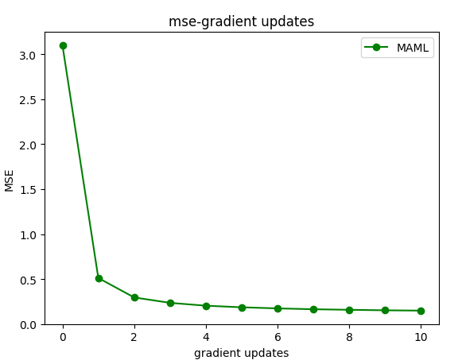
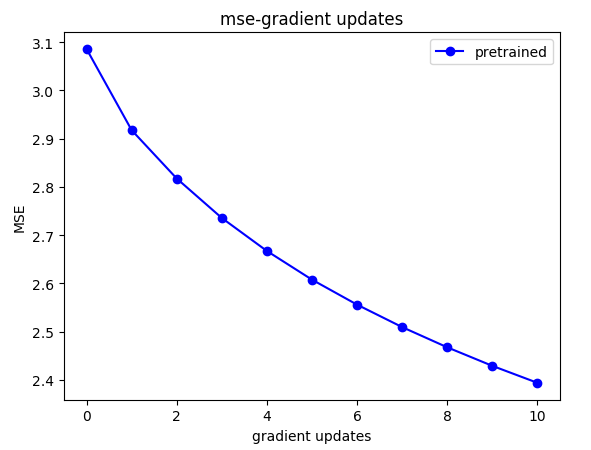
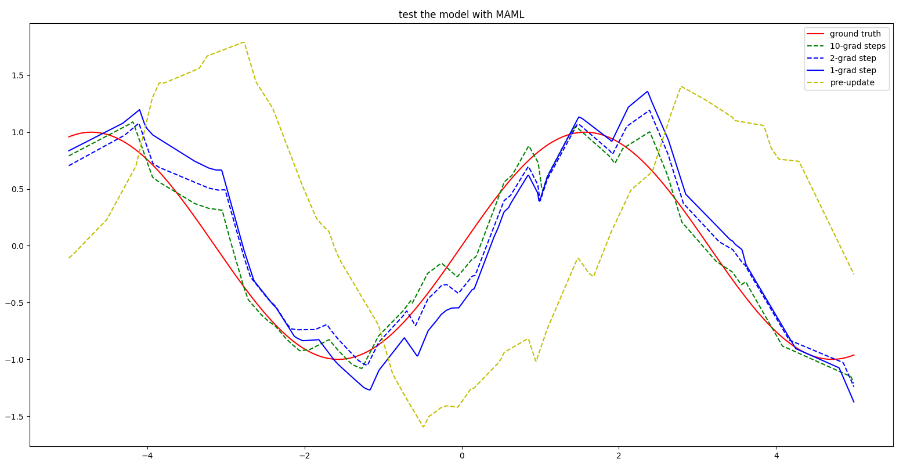
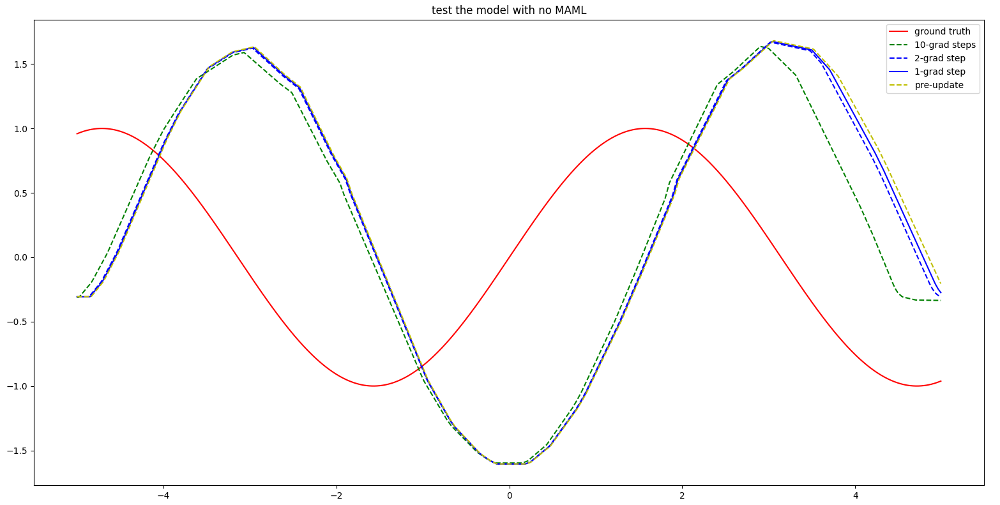

# MetaLearning

## 1、问题与方法

对于ICML2017的paper《Model-Agnostic Meta-Learning for Fast Adaptation of Deep Networks》的算法理解与应用。
要解决的问题其实是：**在小样本数据集上快速地学习到有效的数据分布表征。**

Learning to learn(Meta Learn) is a powerful paradigm for enabling models to learn from data more effectively and efficiently.

	核心算法如下图所示：

   

In effect, the test error(from inner learner) on sampled tasks Ti serves as the training error(to meta learner) of the meta learning process.

内层和外层要同时优化的目标是权值参数Theta，本质上其实是学习一个很sensitive的权值（可以和迁移学习进行比较），使得能够**quickly (in a small number of gradient steps) and efficiently (using only a few examples)**。如下图所示：

   

MAML is actually finding a good initialization of model parameters for several tasks.
Good initialization of parameters means that it can achieve good performance on several tasks with small number of gradient steps and k-shot examples.

## 2、复现实验结果

通过对论文中的结果进行复现，如下所示。这里的pretrained是一个纯神经网络2层，每一层40个神经元，利用relu进行非线性转换。

    evaluation error with MAML

    evaluation error with no MAML

使用sin函数进行模型的测试发现结果如下。

    sin test with MAML

   	sin test with no MAML

## 3、结论

	MAML确实是解决了论文中提出的问题：在小样本数据集上快速地学习到有效的数据分布表征，相比DNN更进了一步。