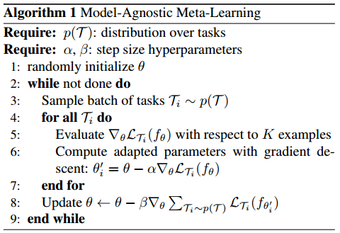
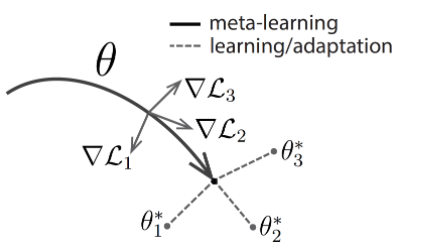

# MetaLearning
对于ICML2017的paper《Model-Agnostic Meta-Learning for Fast Adaptation of Deep Networks》的算法理解与应用。

	核心算法如下图所示：
   

    In effect, the test error(from inner learner) on sampled tasks Ti serves as the training error(to meta learner) of the meta learning process.
内层和外层要同时优化的目标是权值参数Theta，本质上其实是学习一个很sensitive的权值（可以和迁移学习进行比较），使得能够**quickly (in a small number of gradient steps) and efficiently (using only a few examples)**。如下图所示：
   

    MAML is actually finding a good initialization of model parameters for several tasks.
    Good initialization of parameters means that it can achieve good performance on several tasks with small number of gradient steps and k-shot examples.

